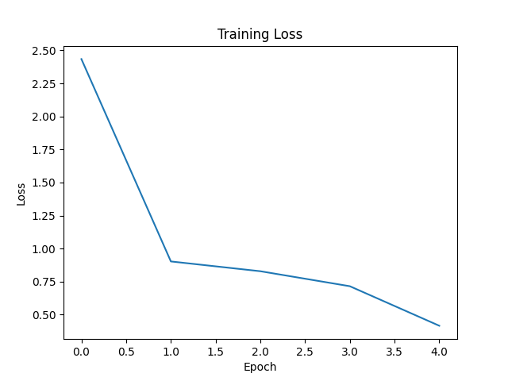
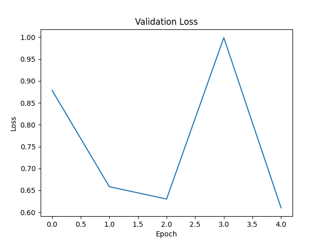
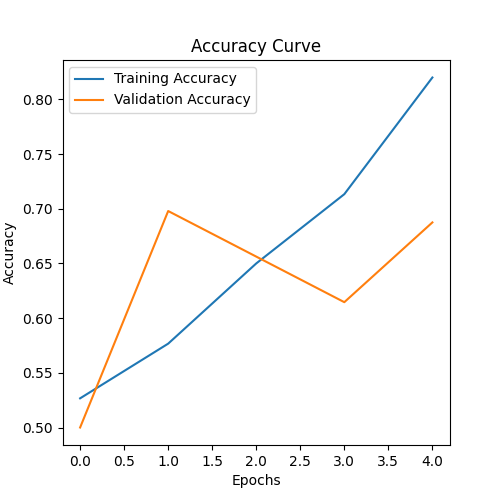
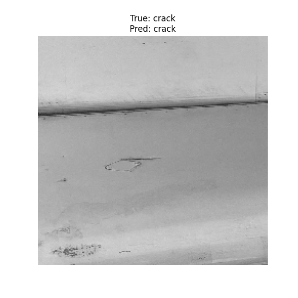
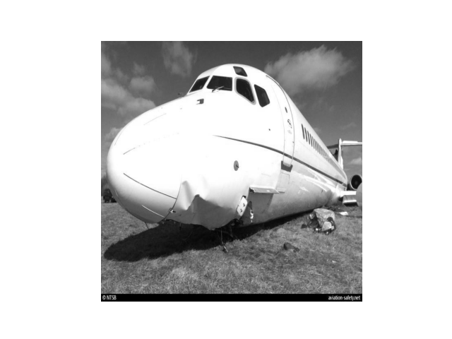

# Aircraft Damage Classification & Captioning

This project performs:
- **Classification** of aircraft images into `damaged` vs `undamaged` using a fine-tuned **VGG16** model.
- **Captioning** and **summarization** of aircraft images using a pretrained **BLIP** vision-language model.

The dataset contains images of aircraft in various conditions, structured into training, validation, and test sets.

## About This Report

Here you can find how the actual code that **IBM provided me** with performed.  
I attached the exact code exported from Jupyter Notebook in Python, and these are the results I obtained from running this code on my local machine.

The following sections include:
- Plots of the training & validation loss over epochs
- Accuracy curves
- Examples of true vs predicted classifications
- Image captioning outputs using a vision-language model

## Pipeline Summary

1. **Data Loading & Preprocessing**
   - Found:
     - `300` training images
     - `96` validation images
     - `50` test images
   - 2 classes: `damaged` and `undamaged`

2. **Model Training**
   - Model: `VGG16` pretrained on ImageNet, fine-tuned for binary classification.
   - Trained for `5` epochs.
   - Final metrics:
     - Validation Accuracy: ~69%
     - Test Accuracy: ~62%

3. **Captioning**
   - Used a BLIP-based model to generate captions & summaries for aircraft images.

## Results & Visualizations

### Training & Validation Loss

- **Training Loss vs Epoch**

  

- **Validation Loss vs Epoch**

  

### Accuracy Curve

- **Accuracy vs Epoch**

  

### Confusion Example

- **True: damaged — Predicted: damaged**

  

## Image Captioning Examples

### Example 1

- **Caption:**  
  `this is a picture of a plane`
- **Summary:**  
  `this is a detailed photo showing the engine of a boeing 747`

### Example 2

- **Caption:**  
  `this is a picture of a plane that was sitting on the ground in a field`
- **Summary:**  
  `this is a detailed photo showing the damage to the fuselage of the aircraft`

