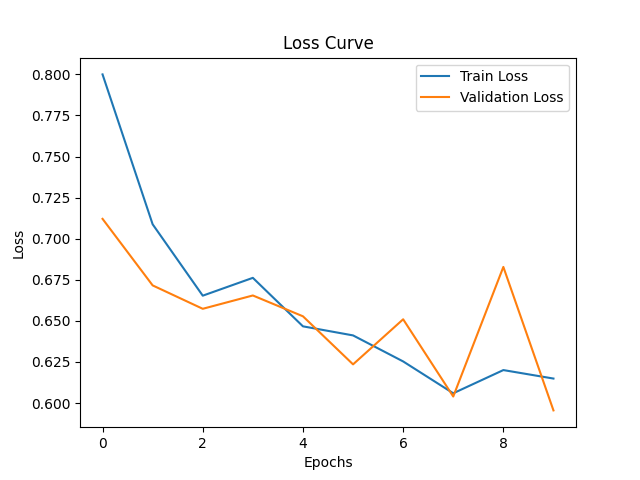
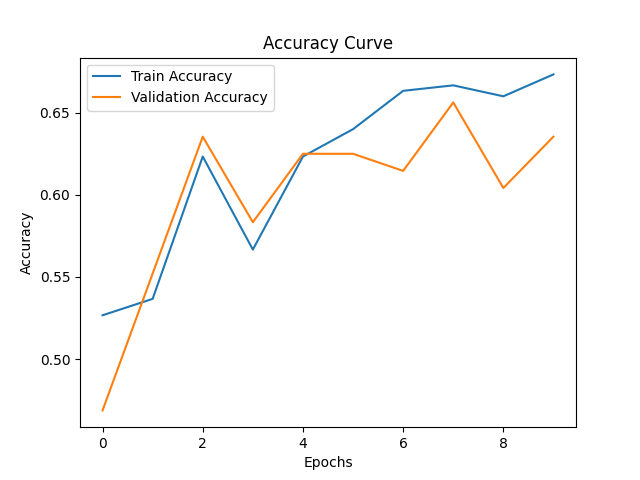
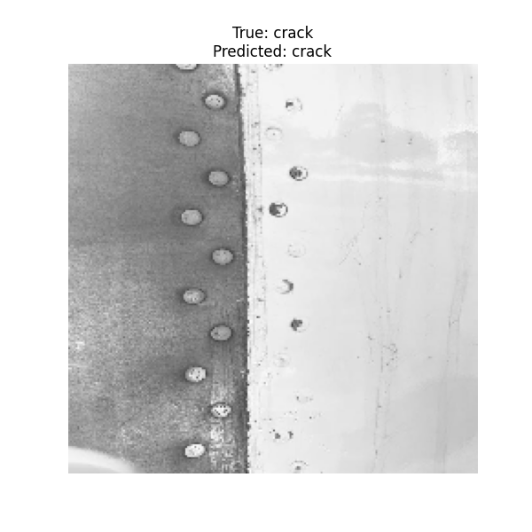

# Aircraft Damage Classification & Captioning (IBM Final Project Refactor)


_Created by **Réka Gábosi**_

## Table of Contents

- [Description](#description)
- [Project Overview](#project-overview)
- [Folder Structure](#folder-structure)
- [Getting Started](#getting-started)
- [Model Performance](#model-performance)
- [Technical Stack](#technical-stack)
- [Original IBM Notebook](#original-ibm-notebook)
- [Acknowledgments](#acknowledgments)

## Description

This project is a restructured and enhanced version of the **IBM Deep Learning and Neural Networks with Keras Capstone Project**. The original project was provided in a Jupyter Notebook. I modularized the codebase into a production-style Python script with class-based design, added visualizations, improved model handling, and integrated image captioning using **BLIP (Bootstrapped Language-Image Pretraining)**.

## Project Overview

This application classifies aircraft images into **“Damaged”** and **“Undamaged”** categories and provides a descriptive caption of the image.

**Main contributions:**

- **Refactored IBM’s Notebook** into clean, reusable, object-oriented Python code.
- **Image Classification** using a fine-tuned pretrained CNN (VGG16).
- **Image Captioning** using HuggingFace's BLIP model.
- Performance visualizations: Accuracy, Loss curves, and example predictions.
- Included the original IBM final notebook for comparison.

## Folder Structure

```
.
├── main.py                                                             # Main Python script containing the entire refactored pipeline
├── aircraft_damage_dataset/                                            # Dataset folder with original IBM aircraft images for classification
├── Jupyter/ Final_Project_Classification_and_Captioning - v1.ipynb     # Original IBM Capstone Jupyter Notebook
├── images/                                                             # Sample images showcased in the README and for testing
├── requirements.txt                                                    # Project dependencies and package versions
├── LICENSE CC BY-ND 4.0                                                # License
└── README.md                                                           # Project overview, instructions, and documentation
```

---

## Getting Started

1. Clone this repository or download the files.
2. Install dependencies:

```bash
pip install -r requirements.txt
```

3. Run the pipeline:

```bash
python main.py
```

## Model Performance

### Classification Results

- **Train Accuracy**: 66.6%
- **Validation Accuracy**: 65.6%
- **Test Accuracy**: 59.4%

Given the limited dataset (300 training, 96 validation, 50 test images), this accuracy is reasonable. Further improvements could be made by:

- Increasing dataset size
- Using more aggressive data augmentation
- Fine-tuning deeper layers of the pretrained model

### Captioning Note

The BLIP model is a general-purpose image captioner and may not fully understand domain-specific objects like aircraft cracks or hulls. For instance, one sample image was captioned:

> **“This is a picture of a metal plate”**\
> **Summary**: “This is a detailed photo showing the detail of the ship’s hull”

Still, it showcases multimodal image understanding.

### Visual Results

| Loss Curve                            | Accuracy Curve                 | Sample Prediction                     |
| ------------------------------------- | ------------------------------ | ------------------------------------- |
|             |  |  |
| Shows smooth learning, no overfitting | Matches validation closely     | **True:** Crack, **Predicted:** Crack |

## Technical Stack

- Python
- TensorFlow / Keras (VGG16)
- HuggingFace Transformers (BLIP)
- Matplotlib / Seaborn (Visualization)
- PIL, NumPy

## Original IBM Notebook

You can find the original version of this project in:

```
Jupyter/ Final_Project_Classification_and_Captioning - v1.ipynb
```

This shows how the code evolved from a monolithic notebook to a modular, maintainable Python project.

## Acknowledgments

I would like to thank IBM for providing the original deep learning capstone project, which served as the foundation for this refactored and enhanced implementation. This project is a tribute to their excellent work and educational resources.